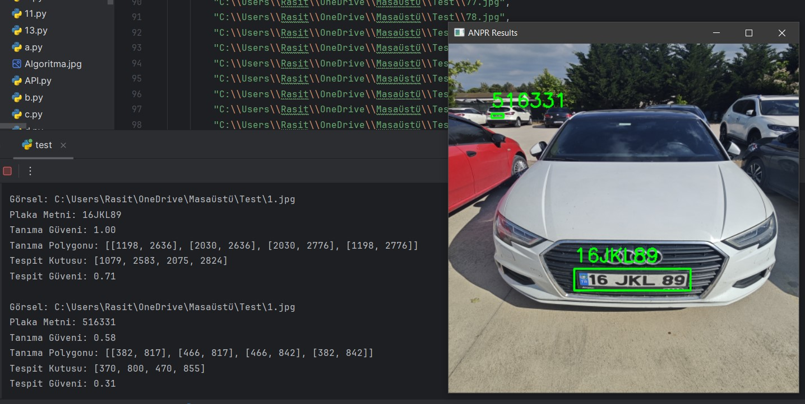

# FastANPR Vehicle License Plate Recognition System 🚗

- This project implements a real-time vehicle license plate recognition system using open-source FastANPR, YOLOv8, and PaddleOCR. The system can process static images, video files, and live camera feeds (IP camera).
- It is suitable for applications such as traffic monitoring, security, parking automation, and access control systems 

📝 Project Overview 
- The license plate recognition process consists of two main stages:
1. Plate Detection
 - YOLOv8 object detection model is used to locate vehicle license plates in the image.
 - High detection accuracy is achieved even in low-resolution or challenging environments.
2. Character Recognition (OCR)
  - PaddleOCR engine reads characters from the detected plates.
  - Ensures high recognition accuracy, typically above 90% for tested scenarios.
- The combination of YOLOv8 and PaddleOCR provides a lightweight, flexible solution capable of working on embedded systems or resource-constrained devices.

⚙️ System Modules
- The system provides three modes of operation:
- | Module     | Description                                    |
- | ---------- | ---------------------------------------------- |
- | `canli.py` | Real-time recognition from live camera streams |
- | `test.py`  | Batch recognition on single images             |
- | `video.py` | Frame-by-frame recognition from video files    |

All modules are implemented in Python with OpenCV for image processing.

🚀 Features
- Real-time license plate detection and recognition
- Works on images, video files, and live camera streams
- High OCR accuracy (>90%) using PaddleOCR
- Lightweight and flexible design for embedded or low-resource environments
- Easy to extend to multiple use cases: traffic monitoring, parking automation, security, etc.

📂 Project Structure
FastANPR/
- │── canli.py           # Live camera recognition module
- │── test.py            # Single image batch recognition
- │── video.py           # Video file recognition
- │── README.md          # Project description
- │── requirements.txt   # Dependencies
- │── models/            # YOLOv8 and PaddleOCR models (optional)
- │── results/           # Detected plates and outputs

- git clone https://github.com/Rasittekin18/FastANPR.git
- cd FastANPR
- pip install -r requirements.txt

▶️ Usage
1. Live Camera Mode:
- python canli.py
2. Single Image Batch Mode:
python test.py --input path/to/images/
3. Video File Mode:
python video.py --input path/to/video.mp4

- Detected plates are highlighted in the output with recognized characters overlaid.
- Supports real-time IP camera feeds using canli.py.

📸 Screenshot Example 

📊 Performance
- High accuracy in detection and OCR recognition
- Works reliably under low-resolution and challenging environmental conditions
- Suitable for embedded systems or low-resource hardware 

